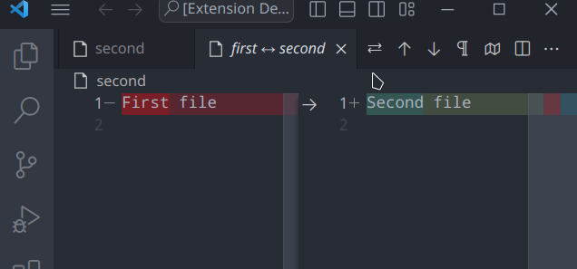

# swapdiff Extension for Visual Studio Code

Quickly swaps out documents open in diff mode



## Install

Launch VS Code Quick Open (Ctrl/Cmd+P), paste the following command, and press enter.
```
ext install swapdiff
```

## Commands

* `extension.swapdiff.swapdiff`: Swap diff documents

